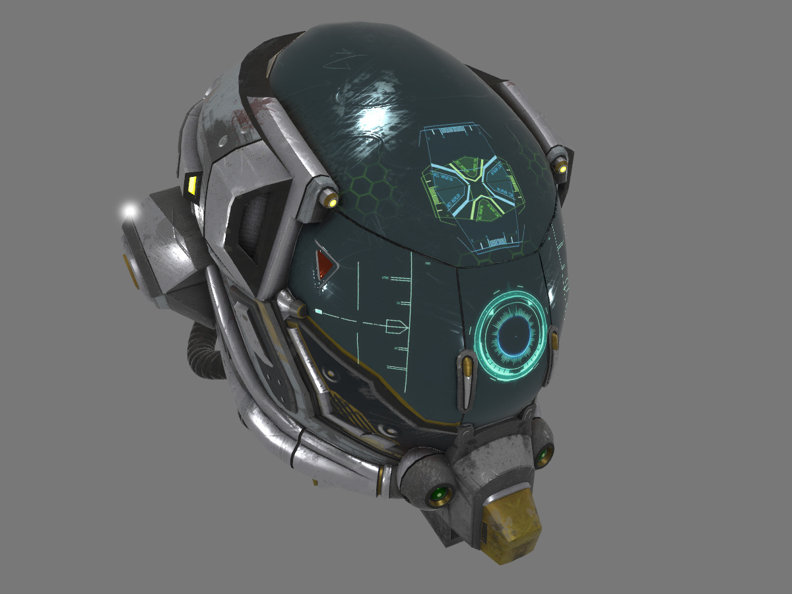
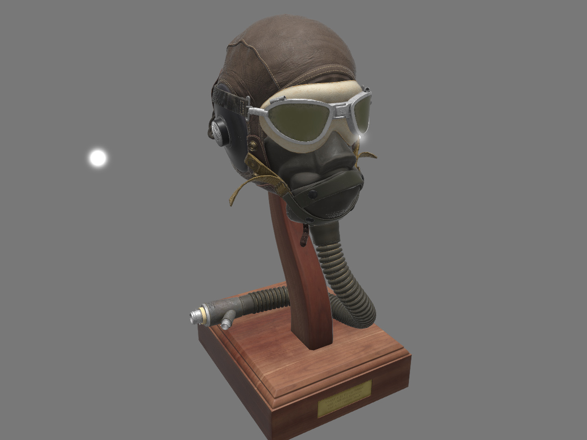
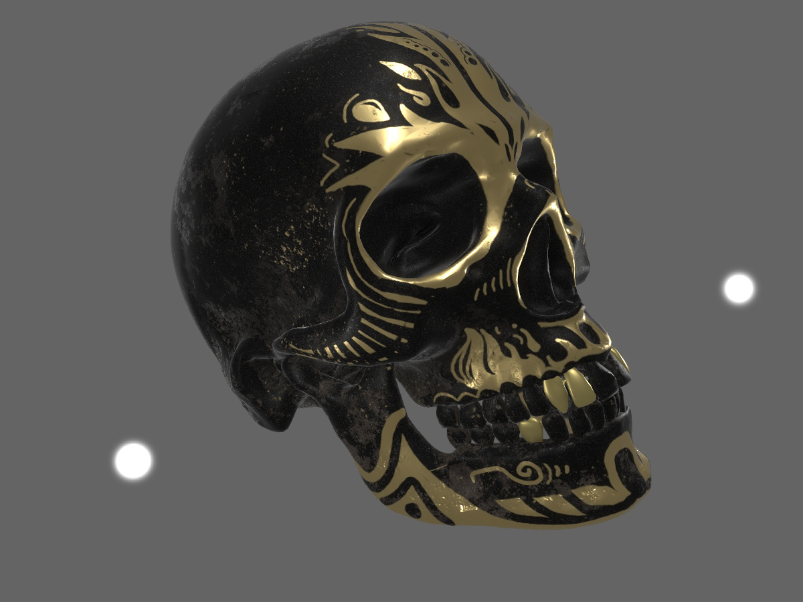
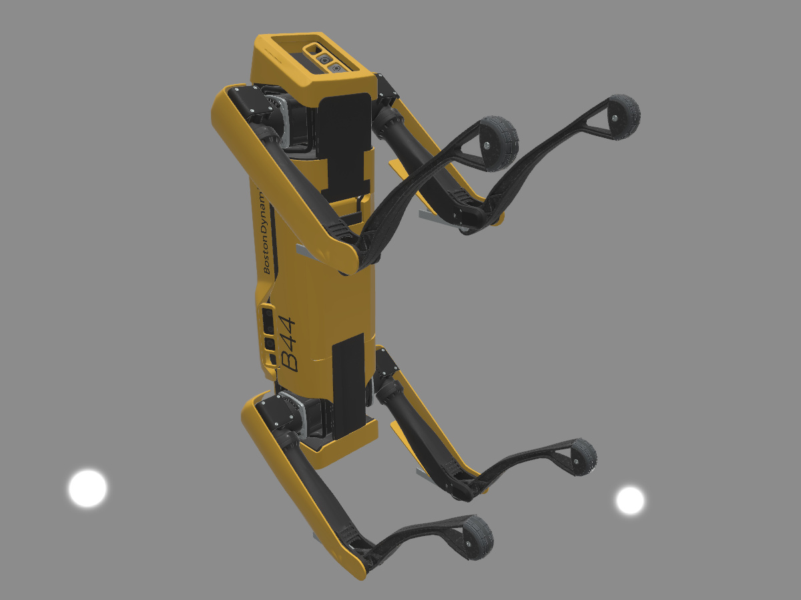
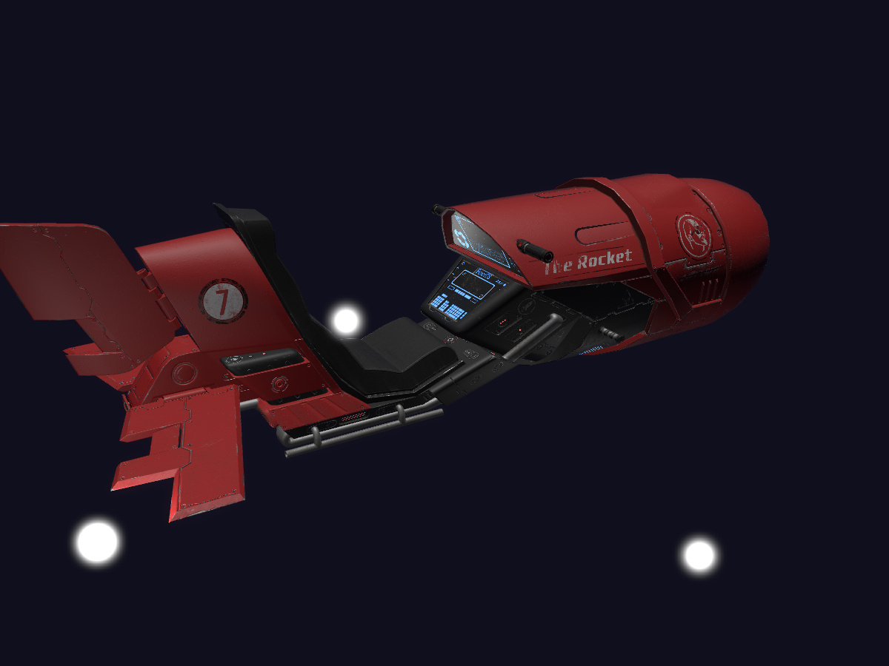

Simple DirectX 11 pet renderer.

## Things done

 - Materials
    - PBR metalness material with layered approximation
    - Normal, emission, and ambient occlusion
 - Lights
   - Point, directional, ambient (constant background)
   - Defined in physical quantities/units
 - Linear workflow
 - Scenes
    - Static glTF
    - Hard-wired
 - Post processing
    - Physically-based bloom

## Screenshots

"Battle Damaged Sci-fi Helmet" model by [theblueturtle_](https://sketchfab.com/theblueturtle_).

"Flight Helmet" model donated by Microsoft for glTF testing.

"Skull Salazar" model by [João Vitor Souza](https://sketchfab.com/jvitorsouzadesign).

"Spot Mini" model by [Greg McKechnie](https://sketchfab.com/mckechniegreg6).

"The Rocket" model by [TuppsM](https://sketchfab.com/TuppsM).

## Licenses (under construction)

- [ACES Tone Mapping Curve](https://knarkowicz.wordpress.com/2016/01/06/aces-filmic-tone-mapping-curve/) by [Krzysztof Narkowicz](https://knarkowicz.wordpress.com/author/knarkowicz/): [CC0 1.0](https://creativecommons.org/publicdomain/zero/1.0/)
- [ACES Tone Mapping Curve](https://github.com/TheRealMJP/BakingLab/blob/master/BakingLab/ACES.hlsl) by [Stephen Hill](https://twitter.com/self_shadow): MIT license
- &hellip;

