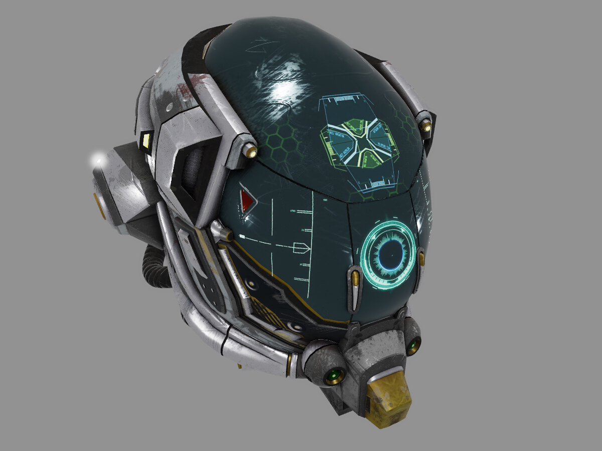

Simple DirectX 11 pet renderer.

## Things done

 - Materials
    - PBR metalness material with layered approximation
    - Simple Blinn-Phong material
 - Lights
   - Point, directional, ambient (constant background)
   - Defined in physical quantities/units
 - Linear workflow
 - Scenes
    - Static glTF
    - Hard-wired
 - Post processing
    - Physically-based bloom

## Screenshots

Model by [theblueturtle_](https://sketchfab.com/theblueturtle_).

Model by [João Vitor Souza](https://sketchfab.com/jvitorsouzadesign).