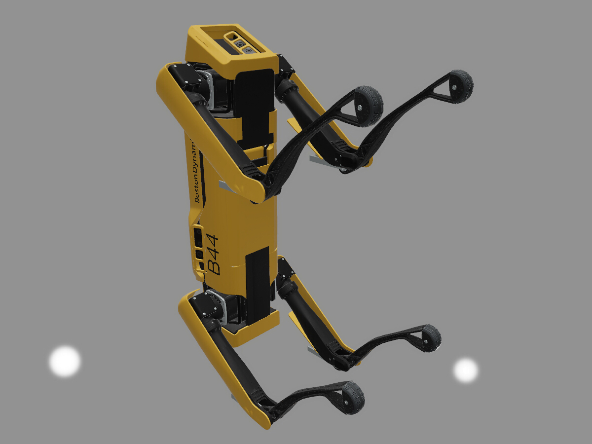

Simple DirectX 11 pet renderer.

## Things done

 - Materials
    - PBR metalness material with layered approximation
    - Normal, emission, and ambient occlusion
 - Lights
   - Point, directional, ambient (constant background)
   - Defined in physical quantities/units
 - Geometry
    - Static glTF
    - Hard-wired scenes
 - Linear workflow
 - Post processing
    - ACES tone mapping
    - Physically-based bloom

## Screenshots

"Battle Damaged Sci-fi Helmet" model by [theblueturtle_](https://sketchfab.com/theblueturtle_):

"Flight Helmet" model donated by Microsoft for glTF testing:

"Skull Salazar" model by [João Vitor Souza](https://sketchfab.com/jvitorsouzadesign):

"Spot Mini" model by [Greg McKechnie](https://sketchfab.com/mckechniegreg6):

"The Rocket" model by [TuppsM](https://sketchfab.com/TuppsM):

## Licenses

- TinyGLTF by [Syoyo Fujita](https://twitter.com/syoyo) &ndash; MIT license. It uses the following third party libraries:
  - json.hpp: Copyright (c) 2013-2017 Niels Lohmann. MIT license.
  - base64: Copyright (C) 2004-2008 René Nyffenegger.
  - [stb_image.h](https://github.com/nothings/stb/blob/master/stb_image.h): v2.08 &ndash; public domain image loader.
  - [stb_image_write.h](https://github.com/nothings/stb/blob/master/stb_image_write.h): v1.09 &ndash; public domain image writer.
- MikkTSpace by Morten S. Mikkelsen &ndash; zlib/libpng license.
- [ACES Tone Mapping Curve](https://knarkowicz.wordpress.com/2016/01/06/aces-filmic-tone-mapping-curve/) by [Krzysztof Narkowicz](https://knarkowicz.wordpress.com/author/knarkowicz/) &ndash; [CC0 1.0](https://creativecommons.org/publicdomain/zero/1.0/) licence.
- [ACES Tone Mapping Curve](https://github.com/TheRealMJP/BakingLab/blob/master/BakingLab/ACES.hlsl) by [Stephen Hill](https://twitter.com/self_shadow) &ndash; MIT license.

